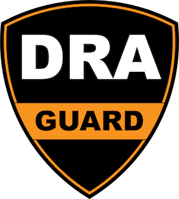
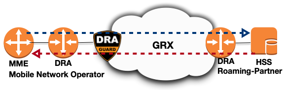
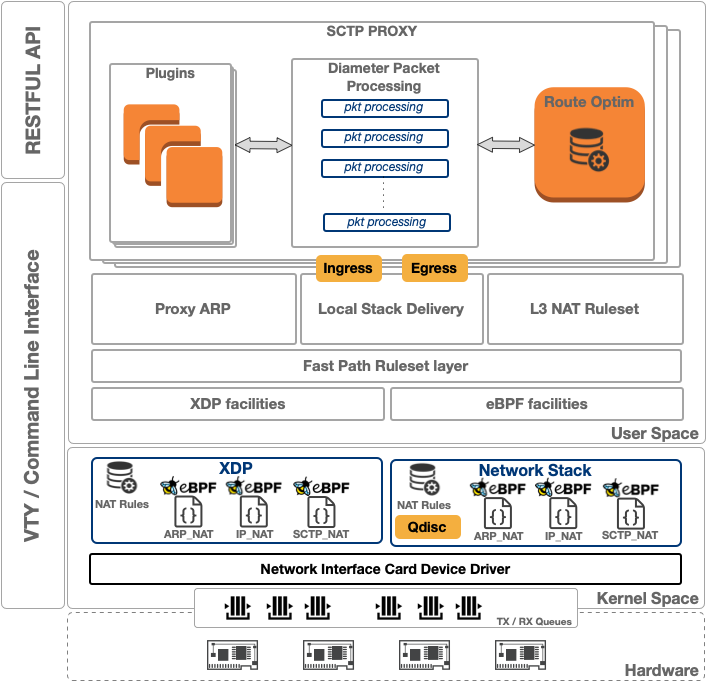

---
hide:
  - navigation
---
# Welcome to DRA-Guard

DRA-Guard is a routing software written in C. The main goal of this project is to provide robust and secure extensions to **DRA** feature (**Diameter Routing Agent**). DRA are used in mobile networks in order to redirect users terminals to their HPLMN in Roaming situations. DRA-Guard implements a set of features to manipulate and analyze Diameter payloads via a **Plugin framework** and a built-in **Route-Optimization** feature. DRA-Guard relies on Linux Kernel **XDP** & **Qdisc** frameworks using **eBPF** for low-level features like transparent mode operations. Administration and user-level interface are available via a standard VTY terminal interface.

DRA-Guard is free software; you can redistribute it and/or modify it under the terms of the GNU Affero General Public License Version 3.0 as published by the Free Software Foundation.

---

# Network Architecture

# Software Architecture

